# Photo Tagger

<p align="center">
  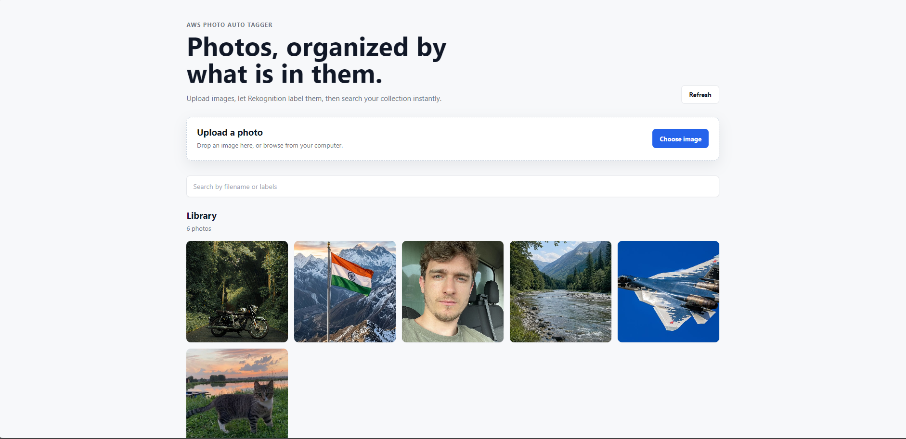
</p>

<p align="center">
  <strong>AI-powered photo management application built with React and AWS.</strong>
</p>

---

## About

I built this project to get hands-on experience with AWS serverless services by creating something practical instead of just following tutorials.

Photo Tagger lets users upload photos, automatically detects what's inside them using Amazon Rekognition, stores the detected labels in DynamoDB, and makes the photos searchable through a simple React interface.

While building this project, I learned how different AWS services work together, from generating pre-signed URLs for secure uploads to processing images with Lambda functions and storing metadata in DynamoDB.

---

## Features

- Upload photos directly to Amazon S3
- Automatic image labeling using Amazon Rekognition
- Search photos using filenames or detected labels
- Responsive photo gallery
- Full-screen image preview
- Download original images
- Delete uploaded photos
- Serverless backend built with AWS

---

## Live Demo

🚀 **Coming Soon**

---

# Architecture

<p align="center">
  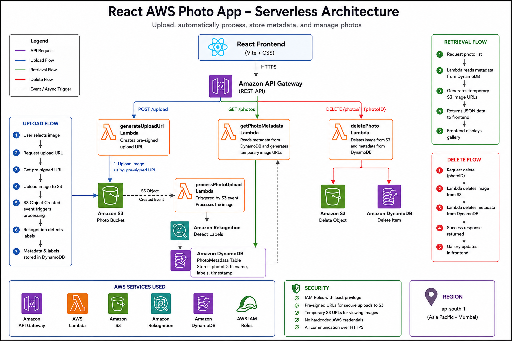
</p>

### Workflow

1. User uploads an image.
2. The frontend requests a pre-signed upload URL.
3. API Gateway calls a Lambda function.
4. Lambda generates a pre-signed S3 upload URL.
5. The image is uploaded directly to Amazon S3.
6. S3 triggers another Lambda function.
7. Amazon Rekognition detects labels in the image.
8. Image metadata and labels are stored in DynamoDB.
9. The frontend fetches the metadata through API Gateway.
10. Users can search, preview, download, or delete photos.

---

# Screenshots

## Home

<p align="center">

</p>

The landing page where users can upload photos and access the gallery.

---

## Upload

<p align="center">
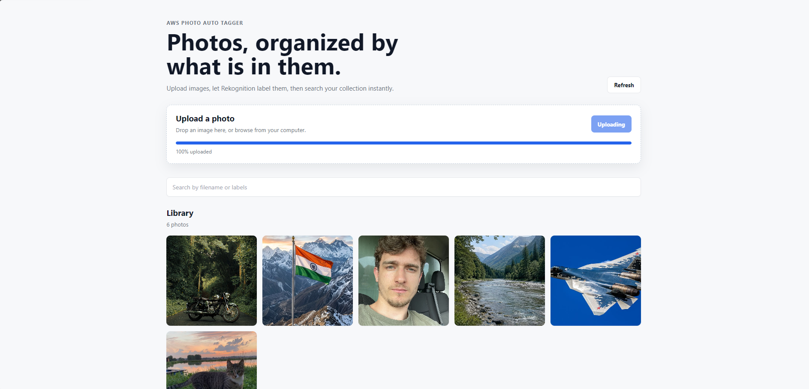
</p>

Uploading an image directly to Amazon S3 using a pre-signed URL.

---

## Gallery

<p align="center">
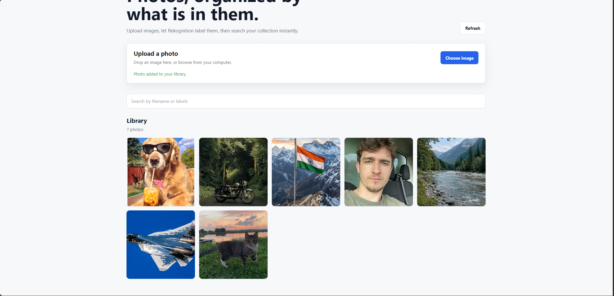
</p>

All uploaded photos are displayed in a responsive gallery with metadata.

---

## Search

<p align="center">
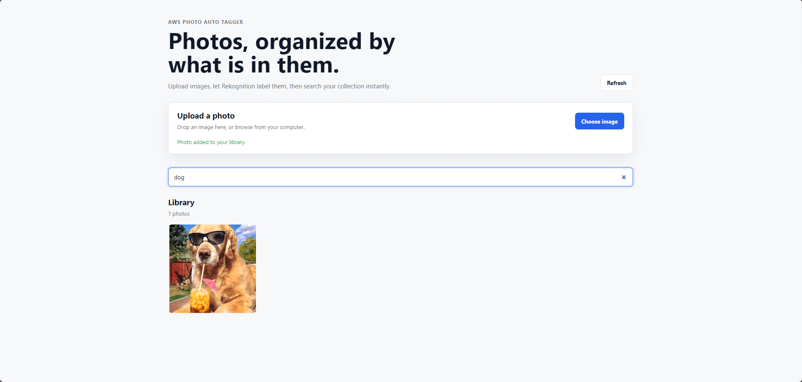
</p>

Search photos using filenames or labels detected by Amazon Rekognition.

---

## Photo Preview

<p align="center">
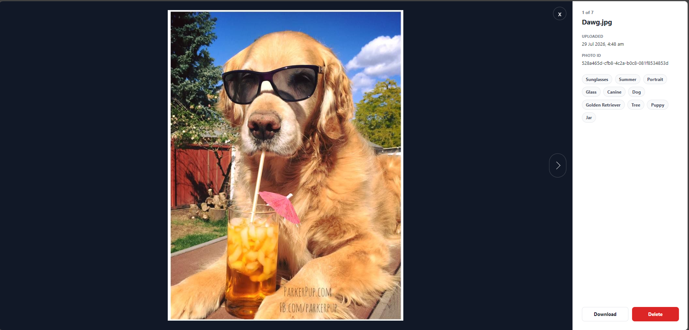
</p>

Preview images in full screen and download or delete them.

---

## Delete Confirmation

<p align="center">
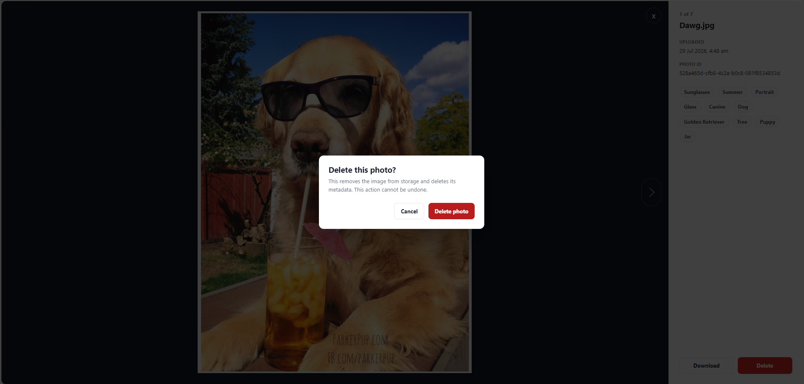
</p>

Confirmation dialog before permanently deleting a photo.

---

# AWS Resources

## API Gateway

<p align="center">
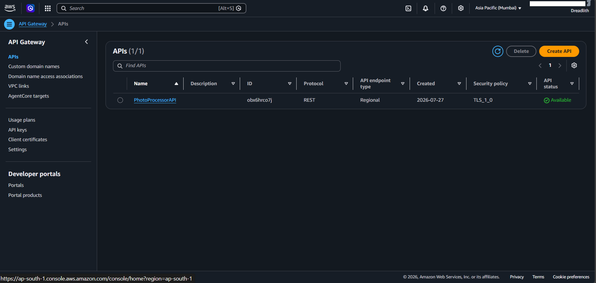
</p>

Handles all API requests between the frontend and AWS services.

---

## AWS Lambda

<p align="center">
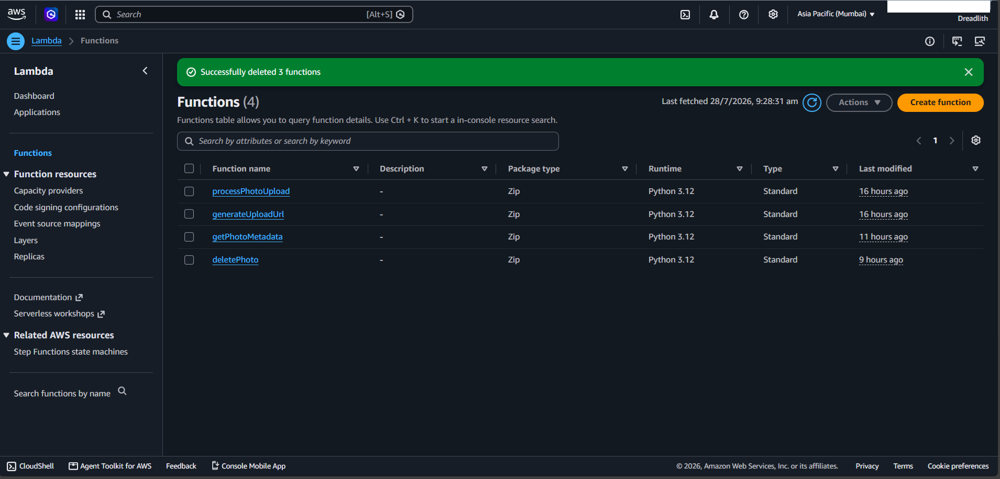
</p>

Processes uploads, retrieves photo metadata, and manages photo deletion.

---

## Amazon S3

<p align="center">
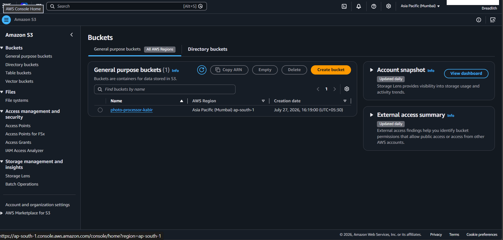
</p>

Stores uploaded images securely.

---

## Amazon Rekognition

Automatically analyzes uploaded images and detects labels used for searching.

---

## Amazon DynamoDB

<p align="center">
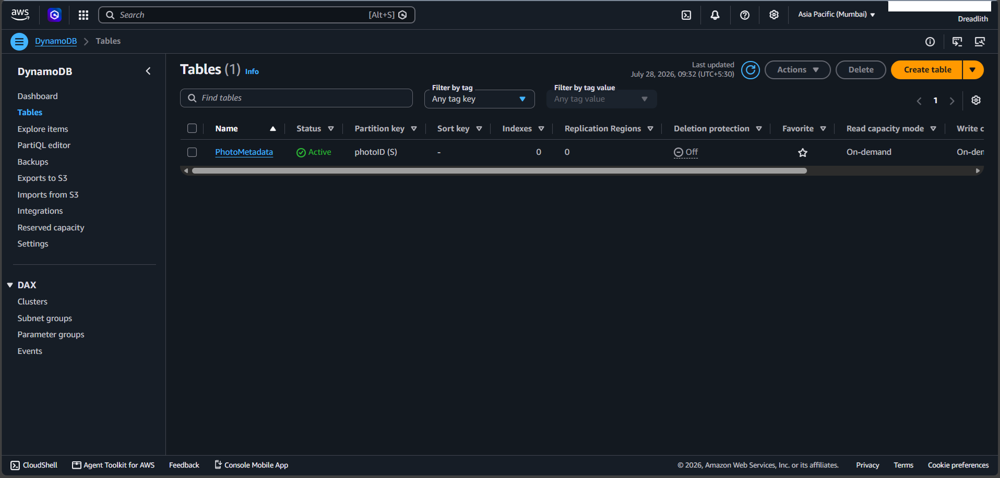
</p>

Stores photo metadata and detected labels.

---

## IAM

<p align="center">
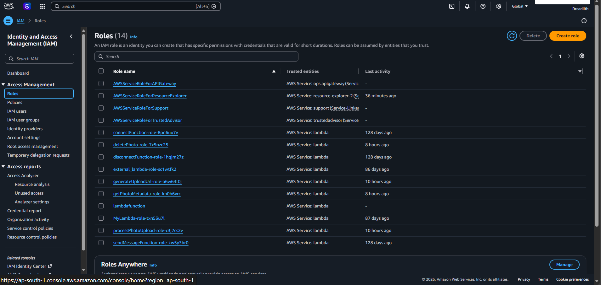
</p>

Provides secure permissions between AWS services.

---

# Tech Stack

### Frontend

- React
- Vite
- JavaScript
- CSS

### Backend

- AWS Lambda
- Amazon API Gateway
- Amazon S3
- Amazon Rekognition
- Amazon DynamoDB
- AWS IAM

---

# Project Structure

```text
photo-tagger/
│
├── backend/
├── docs/
│   ├── app/
│   ├── architecture/
│   └── aws/
├── public/
├── src/
├── package.json
├── vite.config.js
└── README.md
```

---

# Getting Started

Clone the repository

```bash
git clone https://github.com/YOUR_USERNAME/photo-tagger.git
```

Go into the project

```bash
cd photo-tagger
```

Install dependencies

```bash
npm install
```

Start the development server

```bash
npm run dev
```

Create a `.env` file and add your API Gateway endpoint.

```env
VITE_API_BASE_URL=YOUR_API_GATEWAY_URL
```

---

# What I Learned

This project gave me practical experience with AWS serverless architecture. Before building it, I had only used these services individually. Working on this project helped me understand how API Gateway, Lambda, S3, DynamoDB, and Rekognition work together to build a complete application.

It also helped me improve my React skills by building a cleaner and more user-friendly interface.

---

# Future Improvements

- User authentication
- Face recognition
- Albums and collections
- Infinite scrolling
- Drag-and-drop uploads
- Dark mode
- Better filtering options

---

## Author

**Kabir Juneja**

GitHub: https://github.com/kabirjuneja

---

If you have any suggestions or find any issues, feel free to open an issue.
